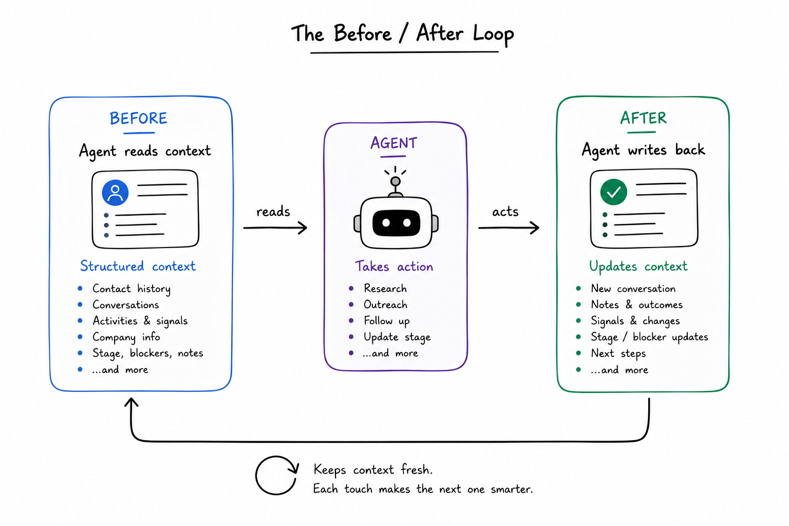
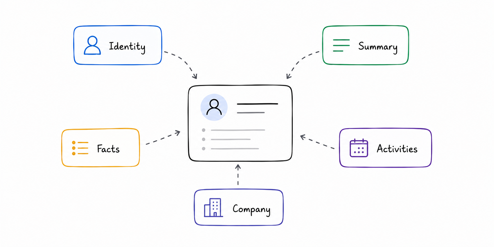
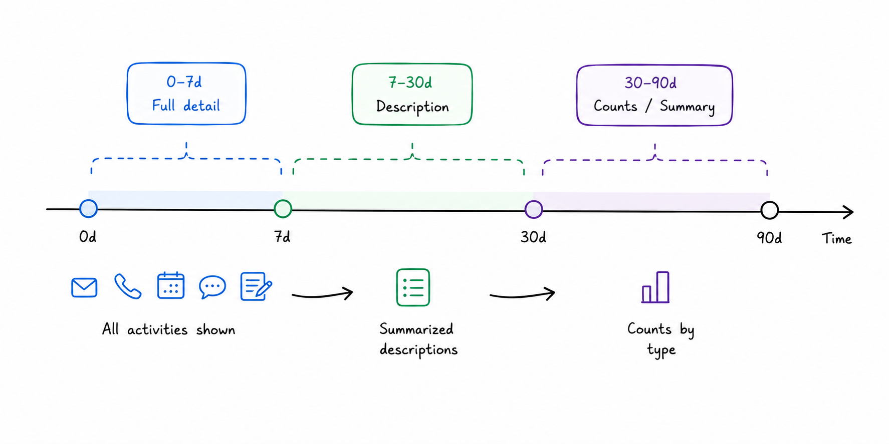
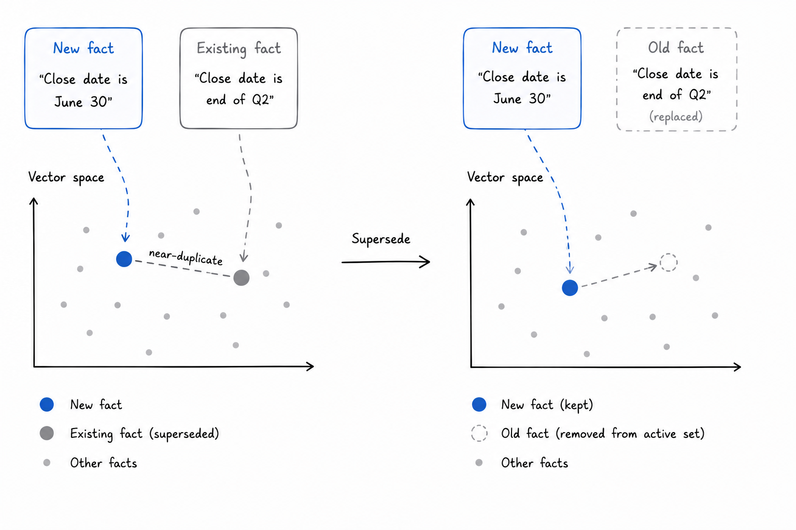

# Context Engineering for GTM Agents

Every GTM agent that touches a contact starts from a blank slate unless you give it one. Without deliberate context construction, the agent has no idea whether this is a warm prospect mid-evaluation or a cold lead who went silent six months ago. It doesn't know what the blocker is, what was promised on the last call, or what the company looks like. It will re-ask questions that were already answered, miss urgency signals that were already captured, and act on a relationship it doesn't understand.

Context engineering is the practice of deliberately constructing what goes into the model's context window before it acts on a contact — deciding what to include, what to compress, and in what order. We built a structured context layer for Proply that every agent reads before taking any action on a contact and writes back to after.

## The Setup

The context for any contact is assembled from five layers: identity and firmographics (company, title, ICP score, pipeline stage, warmth), an AI-generated summary of the relationship, memory facts stored by previous agents or integrations, activity signals with temporal compression, and company-level context including other stakeholders at the account.

We expose this as a single API call — `get_contact` by email or UUID — that returns all five layers in one response. The agent doesn't have to assemble context from multiple sources or join records itself. Every layer has already been computed, ordered, and formatted for consumption.

## The Token Budget Problem

A contact with two years of interaction history can't fit in a context window. Even if it could, you wouldn't want it to — raw history is noise. The signal is buried: a budget conversation from eight months ago, a blocker raised on call three weeks before that, a strong buying signal from a demo that happened six months later.

Three things make context construction hard in practice.

**Recency is not relevance.** The most recent signal isn't always the most important one. Last week's "just checking in" email carries less signal than a pricing objection from three months ago. A context window that surfaces the last N activities without weighting for signal strength will consistently miss what the agent actually needs.

**Facts decay at different rates.** A contact's job title changes infrequently. Their Q3 budget constraint is time-sensitive. Their objection to a specific integration is persistent until explicitly resolved. Treating all stored facts as equally current produces misleading context.

**Deduplication compounds.** When multiple agents write facts about the same contact, you get near-duplicate entries within weeks. By the time a third agent reads that contact, the fact list is bloated with variations on the same statement. The context reads like noise.

## How We Construct the Context Window

We apply three distinct treatments to activity history based on recency.

Activities from the **last seven days** include full message bodies. These are the signals most likely to be acted on immediately — a reply to a proposal, a question raised after a demo, a follow-up that came in this week. The agent needs the verbatim content.

Activities from **seven to thirty days** ago are included by description only. The agent can see what happened and when, but not the full text. This covers the recent but not urgent layer — enough to understand momentum without burning token budget on complete message bodies.

Activities from **thirty to ninety days** ago are represented as counts by type. Three calls held, two emails sent, one proposal sent. The agent understands the relationship density without reading individual records.

Beyond ninety days, nothing. If a signal from that period becomes relevant, it surfaces through the AI summary or a stored memory fact — not raw activity.

Memory facts are returned in a fixed priority order: blockers and objections first, then active constraints (budget, timeline, authority), then preferences and technical context, then general notes. The agent reads the most decision-relevant facts before anything else.

The summary is a single pre-computed paragraph that captures the relationship state right now — stage, primary concern, last meaningful interaction, and what the next action should be. We generate this at activity write time, not at read time, so the agent gets it instantly.

## Fact Deduplication and Superseding

Every time a fact is written, we run a similarity check against existing facts scoped to the same contact. If an existing fact is above a similarity threshold and belongs to the same category, the new fact supersedes it — the old one is soft-deleted and replaced. This keeps the fact list clean without requiring the agent to manage deduplication manually.

The superseding logic runs at write time, not read time. By the time the next agent reads the contact, it sees a deduplicated, current fact list. Facts that were true six months ago and have since been updated don't appear alongside their replacements.

We also run an extraction pass when bulk text is passed to `remember`. A call transcript or email thread is parsed for atomic facts, each fact is categorized automatically, and each is checked against the existing fact list individually. Passing an entire transcript doesn't create one blob — it creates three or four specific, searchable, supersedable facts.

## Principles

**Context construction is a product decision, not a prompt decision.** What you put in the context determines what the agent can reason about. A well-written system prompt with poor context produces poor output. The investment is in the data layer.

**Compression preserves signal resolution.** The goal of temporal compression isn't to discard information — it's to represent it at the right resolution for the agent's task. Full bodies where precision matters, summaries where trend matters, counts where density matters.

**The summary exists so the agent doesn't have to re-derive it.** Pre-computing the relationship state means every agent starts at the current understanding of the relationship, not at raw history. The cost is paid once at write time and amortized across every subsequent read.

**Recency is not relevance.** A blocker from four months ago shapes the next conversation more than last week's pleasantry. Context that surfaces by timestamp alone consistently delivers the wrong signal at the wrong moment.

**The after-write compounds.** Context quality is not static. Every agent that writes back — logging what happened, storing what was learned — makes the next agent's context better. The value of the memory layer grows with every interaction, not just with the size of the contact list.
