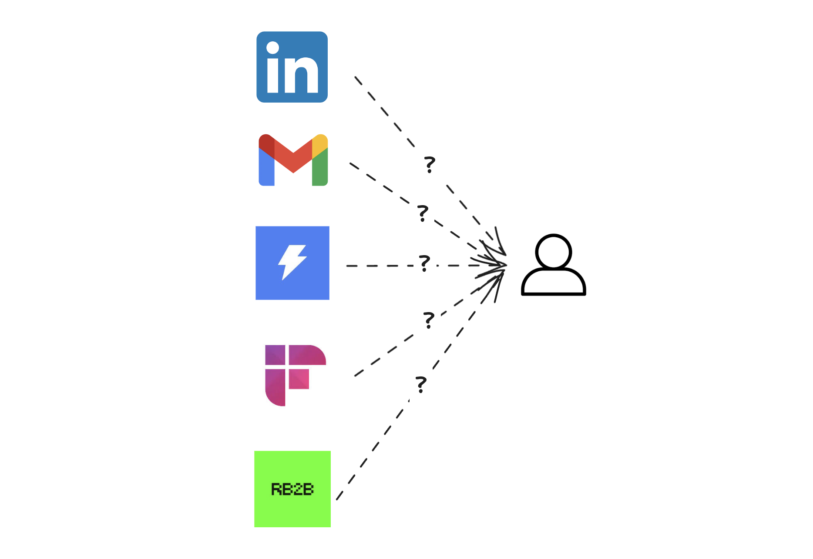
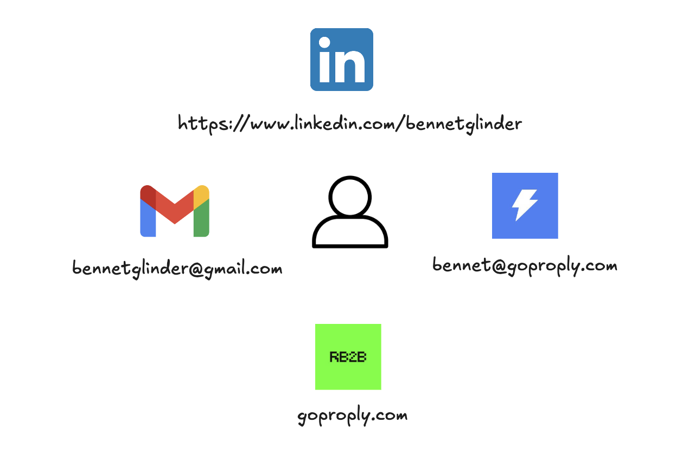
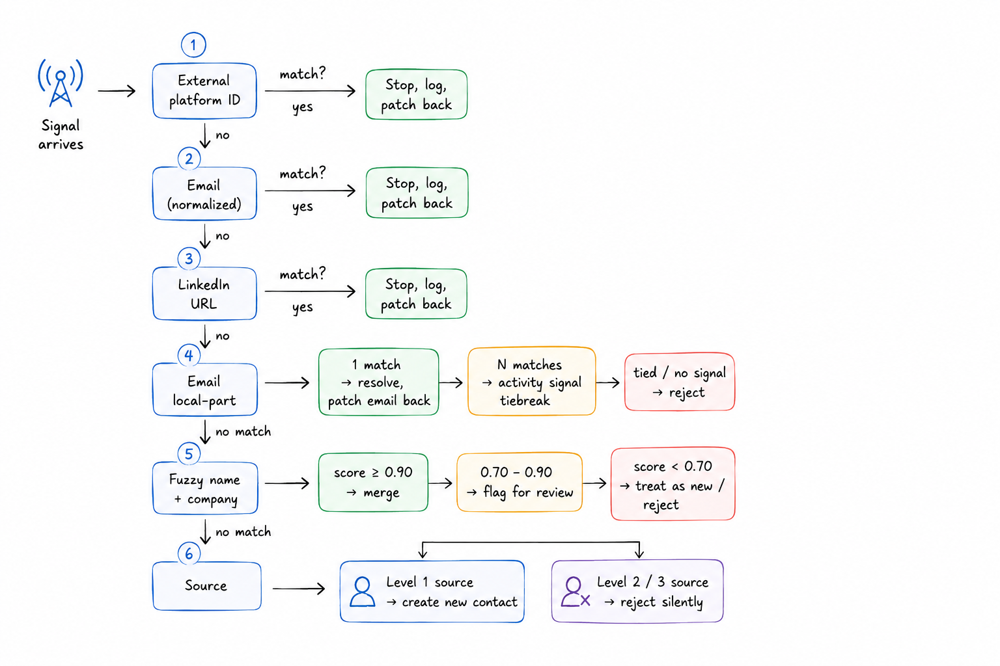
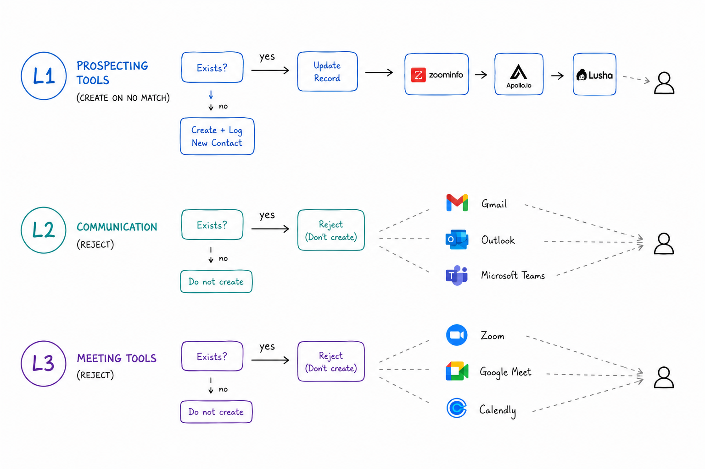

# Entity Resolution

Every GTM tool assigns its own identifier to the same person. RB2B identifies a site visitor by IP and email. Instantly tracks them by sequence contact ID. LinkedIn sends a profile URL. Fireflies logs them by display name in a meeting transcript. Google Calendar sends an attendee email with no display name. These identifiers have nothing in common — and yet they all describe the same human being in your pipeline.

Entity resolution is the continuous, real-time problem of matching incoming signal records to the right canonical contact. We built a tiered resolution waterfall that handles this across every integration Proply connects to, under latency constraints that don't allow for batch processing or LLM inference on every record.

## One Person, Many Identifiers

No universal identifier exists across GTM tools. Email is the closest — but it is only present in 60–70% of incoming signals. A Fireflies transcript gives you a participant name with no email. A LinkedIn connection event gives you a profile URL with no email. An RB2B visit gives you an email but a different name format than the same person's record in HubSpot. And the same person often has multiple emails across different tools — personal Gmail in one, work address in another.

Getting resolution wrong in either direction is expensive. A missed match creates a duplicate — your agent treats a warm lead as a cold unknown and starts from scratch. A wrong merge corrupts two relationships into one — your agent acts on someone else's history. Resolution errors compound: one bad match in January corrupts every signal from that source for the life of that contact.

The other pressure is latency. Webhooks fire in real time. You have milliseconds to resolve identity before the signal is stored. Queueing for batch processing means losing the signal or storing it incorrectly.

## The Resolution Waterfall

We resolve every incoming signal through a tiered waterfall, stopping at the first successful match. Each step is ordered by speed and certainty — the fast path covers the majority of signals, the slow path handles the hard cases.

**External platform ID** — every integration assigns its own stable identifier: `rb2b_id`, `hubspot_id`, a sequence contact ID from Instantly. On first encounter we store it alongside the canonical contact. Every subsequent event from that platform matches instantly. This covers roughly 70–80% of signals from active integrations.

**Email (normalized)** — when an external ID isn't present, email is ground truth. Normalization matters: lowercase everything, strip display name wrappers (`"Ben Carter <ben@acme.com>"` → `ben@acme.com`), handle `+` aliases consistently. Un-normalized matching causes silent misses.

**LinkedIn URL (normalized)** — a stable unique identifier per person, but it arrives in multiple formats: with and without `www`, with trailing slashes, as a full URL or just the path. We normalize all forms to the slug and match against a normalized index.

**Email local-part inference** — some integrations provide an attendee email but no name at all. Google Calendar is the primary example: external invitees appear with an email address and nothing else. When no match is found by email, we parse the local part of the address — the portion before the `@` — and attempt to match against contacts who have no email on file.

Two patterns are attempted in order. A single-word local part (`spencer@growthalliance.io`) matches against first name only. A dotted or hyphenated local part (`john.smith@company.com`) splits into first and last name and matches the full name. In both cases, only an exact single match resolves — if zero contacts match or more than one match, we move to the next step.

When the local-part produces multiple candidates — three contacts named Spencer — we tiebreak using the last 14 days of activity. Each candidate's activity history is checked for meeting-intent signals: any record mentioning booking, scheduling, a call, Calendly, or Zoom scores that contact. Exactly one scorer — resolved. Tied scorers or no scorers at all — rejected. The practical case: you exchanged LinkedIn messages with someone about getting on a call, then a calendar invite arrives from an address that matches three people in your workspace by first name. The meeting-intent signal already recorded in that contact's activity log picks the right one without guessing.

On any successful match, the discovered email is written back to the contact record immediately. The next event from that address resolves at the email step.

**Fuzzy name + company** — for signals that carry a name and company but no email or external ID (primarily meeting transcripts from Fireflies), we compute a composite similarity score combining token sort ratio, phonetic encoding, and edit distance for names, plus token overlap for company names. Above 0.90 — auto-merge. Between 0.70–0.90 — flag for human review. Below — new contact or reject depending on source.

At every step, the identifiers used to find a match get patched back onto the contact record. The first time someone is matched by name, their external ID is stored — the next event from that source hits step one instantly.

## Source Trust and Create / Reject

Not every unmatched signal should create a new contact. The decision depends on where the signal came from.

**Level 1 — prospecting sources** (RB2B, Instantly, LinkedIn, Apollo, HubSpot): create on no match. These represent intentional outbound activity. If someone visited your site and isn't in the system, they're a real lead.

**Level 2 — communication sources** (Gmail): reject on no match. Anyone who has ever emailed you would become a contact. The noise ratio is too high.

**Level 3 — meeting sources** (Fireflies, Calendly, Fathom, Google Calendar): reject on no match. Meeting participants aren't necessarily prospects. If no match exists, the signal is discarded — `createIfMissing: false`.

Without this distinction, a single 20-person all-hands transcript creates 20 spurious contacts and fills your pipeline with noise.

Resolution is also idempotent by design. Webhook providers retry failed deliveries — the same signal might arrive 2–5 times. A unique constraint on `(source, external_id)` in the activity log means processing the same event twice produces the same result as processing it once.

## Principles

**Email is ground truth, but it's not always present.** Design for the 30–40% of signals where it's missing. The waterfall has to handle those cases without degrading to create-on-every-miss.

**Store every identifier you encounter.** The first time a contact passes through any tier, patch that tier's identifier back onto the record. Every identifier stored is one fewer lookup needed next time. This applies to discovered emails too — an email resolved from a local-part match gets written back immediately.

**Source trust determines create vs. reject.** A signal that doesn't match is not automatically a new contact — the right answer depends entirely on where it came from.

**When candidates tie, activity history disambiguates.** The same pipeline that stores relationship signals can break identity ties. A contact with a recent meeting-intent signal in their activity log is the right match for a calendar event with a matching first name — not because of inference, but because the signal already happened and was recorded. This only works when the activity log is granular and written in real time.

**Resolution errors compound.** A bad merge in a live stream corrupts every future signal from that source. The asymmetry in error cost — false negative creates a duplicate, false positive corrupts an identity — argues for a high merge threshold and a human review queue for uncertain cases.

**The hard cases are known.** Abbreviations (`IBM` vs `International Business Machines`), nicknames (`Ben` vs `Bennet`), and meeting participants with no email are the three cases the waterfall won't catch automatically. They're addressable — lookup tables, phonetic encoding, enrichment — but worth naming so they don't become silent failures.
