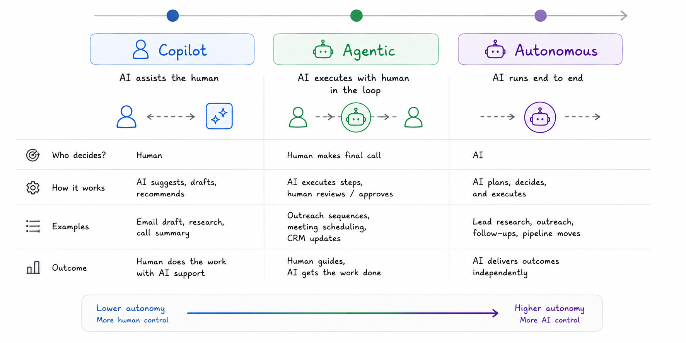
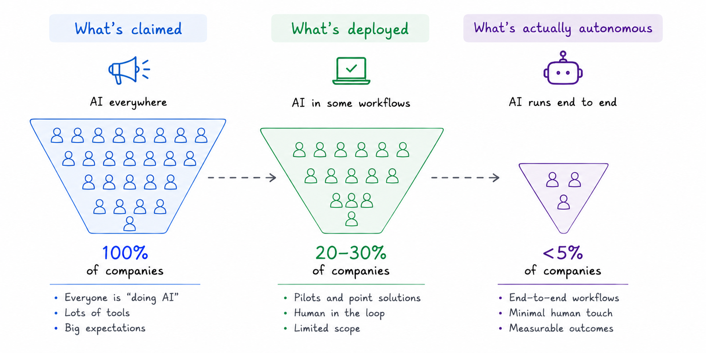

# Autonomous AI

Autonomous AI is not a product category. It is a direction of travel. Most of what gets called autonomous AI today is not — it is agentic AI with a human still holding the reins at key decision points. Truly autonomous systems, where an agent plans, executes, and adapts across a full workflow without human approval at each step, exist in narrow contexts and early pilots.

Gartner has a word for the gap between the marketing and the reality: **agentwashing**. 79% of organizations claim some level of AI agent adoption. 11% have agents running actual production workflows. The distance between those two numbers is where most of the conversation about autonomous AI currently lives.

Understanding that gap — what makes it hard to close, who is closest, and what happens when it does close — matters more than any definition of the term.

## The Autonomy Spectrum

Autonomy is not binary. [Anthropic's empirical research on agent autonomy](https://www.anthropic.com/research/measuring-agent-autonomy), drawn from millions of real interactions across Claude Code and its API, maps five escalating roles a human can play relative to an agent: **operator → collaborator → consultant → approver → observer**. The further right on this spectrum, the more autonomous the agent and the more the human's job shifts from directing to monitoring.

The automotive analogy holds well here. The SAE L0–L5 self-driving scale captures the same underlying dynamic:

- **L0–L2**: The human is always in control. AI assists but does not act.
- **L3**: AI can drive in defined conditions. Human must be ready to retake control.
- **L4**: AI drives without human intervention in defined environments.
- **L5**: Full autonomy. No human needed, in any environment.

The jump from L3 to L4 is where most of the difficulty lives — not because the capability gap is large, but because the trust gap and the governance gap are enormous. The same is true for AI agents. As of May 2026, most production deployments operate between levels 2 and 3. Genuine L4-equivalent autonomy — the agent runs entire workflows end-to-end without human checkpoints — remains rare outside of domains with objective correctness like coding and structured data work.

Three categories help orient the landscape:

- **Copilots** — AI suggests, drafts, and recommends. A human reads every output and decides what to do. The workflow is unchanged. The system assumes humans are the default processor of information.
- **Agentic AI** — AI plans, uses tools, and executes multi-step tasks. Humans supervise and approve at key moments. The workflow changes, but the human remains accountable for outcomes.
- **Autonomous AI** — AI owns the workflow end-to-end. The agent sets intermediate goals, takes actions, monitors outcomes, and adjusts without checking in. Humans review results and handle exceptions. The workflow cannot exist without the agent.

## Where We Actually Are

The honest picture of autonomous AI as of May 2026 is smaller than the headlines suggest and larger than most organizations are prepared for.

[Capgemini's global survey of 1,500 executives](https://www.capgemini.com/insights/research-library/ai-agents/) found that only 2% have deployed AI agents at full scale, 12% at partial scale, 23% are in pilots, and 61% are still exploring. Only 15% of all business processes currently operate at semi-autonomous to fully autonomous levels. The rest use agents as assistants or copilots, not autonomous workers.

The production deployments that exist are concentrated in domains with a specific shared property: **objective correctness**. You can verify whether the code compiles, whether the support ticket resolved, whether the data was enriched accurately. Domains where success and failure are unambiguous are where autonomous AI is furthest along.

[Cognition's Devin](https://cognition.ai/blog/devin-annual-performance-review-2025) is the most documented case. Eighteen months after launch, Devin raised its PR merge rate from 34% to 67%, grew ARR from $1M to $73M between September 2024 and June 2025, and now produces 25% of Cognition's own code. Nubank used Devin on an ETL migration and achieved 12x efficiency improvement in engineering hours and 20x cost savings. One organization cut security vulnerability remediation from 30 minutes per fix to 1.5 minutes. These are not incremental improvements — they are structural changes to how engineering work gets done.

[Salesforce Agentforce](https://www.salesforce.com/agentforce/metrics/) shows the same pattern in customer service. Over 8,000 businesses live. OpenTable resolved 70% of inquiries autonomously. Reddit deflected 46% of cases and cut resolution time from 8.9 minutes to 1.4 minutes. One financial services deployment cut a 15-day reporting process to 35 minutes at a cost reduction from $2,200 to $9 per report.

The numbers are real. The scope is bounded. Every production deployment of genuinely autonomous AI today lives inside a well-defined problem space with clear success criteria.

## Why Full Autonomy Is Hard

The technical capability to build autonomous agents is advancing faster than the organizational capability to deploy them safely. The constraint is rarely the model.

**Trust must be earned at each level, and it has been eroding.** [Trust in fully autonomous AI agents dropped from 43% to 27%](https://www.capgemini.com/news/press-releases/trust-and-human-ai-collaboration-set-to-define-the-next-era-of-agentic-ai-unlocking-450-billion-opportunity-by-2028/) among executives in a single year. Nearly two in five say the risks outweigh the benefits. 80% of organizations have encountered risky or unexpected behavior from deployed agents. That is not irrational caution — it is a rational response to what happened when agents were given scope before operators understood their failure modes.

[Anthropic's data](https://www.anthropic.com/research/measuring-agent-autonomy) shows how trust actually forms: newer users grant full auto-approve in roughly 20% of sessions. By 750 sessions of observation, that rises to over 40%. Trust accrues through watching an agent succeed repeatedly at bounded tasks before expanding its scope. Organizations that skip this calibration phase produce the incidents that erode confidence across the industry.

The finding that cuts against simple "more autonomy = more value" narratives: [hybrid human-AI collaboration achieves 94% user satisfaction versus 67% for fully autonomous operation](https://www.vitalijneverkevic.com/the-state-of-ai-agents-2025/) in comparable deployments. The incremental value of removing the human from the loop is smaller than assumed, and the cost of the occasional failure is larger.

**Autonomous agents need even cleaner infrastructure than agentic agents.** [McKinsey's research on the agentic organization](https://www.mckinsey.com/capabilities/people-and-organizational-performance/our-insights/the-agentic-organization-contours-of-the-next-paradigm-for-the-ai-era) identifies five transformation pillars companies must address together — business model redesign, operating model evolution, governance structures, culture and people, and technology infrastructure. Most organizations attempt only the technology pillar. They pick the model and skip the kitchen.

An agentic system with scattered data produces bad outputs that a human catches. An autonomous system with scattered data produces bad outputs that execute before anyone catches them. [a16z frames this as the core infrastructure problem](https://a16z.com/notes-on-ai-apps-in-2026/): "vast amounts of critical business intelligence are trapped in messy formats — PDF invoices, recorded Zoom calls, Slack threads, screenshots." Agents cannot act reliably on business intelligence they cannot read.

**Governance has not kept pace.** Only one in five companies has a mature governance model for autonomous agents. [The World Economic Forum describes this as the defining paradox of the agentic era](https://www.weforum.org/stories/2025/07/ai-agent-economy-trust/): "The requirement for human oversight may be inherently incompatible with agentic AI systems, which by definition are designed to act on their own." As agent counts scale into the hundreds, the traditional model of one human accountable for one agent breaks down entirely.

The WEF has proposed a **Know Your Agent (KYA)** framework — a trust primitive analogous to Know Your Customer in financial services — as the governance foundation for the autonomous era. Every agent needs a verifiable identity, a documented scope of authority, and a provenance trail that makes its actions auditable. Without this, autonomous AI cannot scale in regulated industries.

[Harvard Business Review identifies a new organizational role emerging from this need](https://hbr.org/2026/02/to-thrive-in-the-ai-era-companies-need-agent-managers): the **agent manager**. Just as product managers emerged during the software revolution, agent managers define what each agent is authorized to do, where its authority stops, and how its performance is measured. The analogy to managing a new hire is deliberate — treat new agents like interns until they have demonstrated they can perform, then extend scope accordingly.

## Who Is Closest (May 2026)

The companies making real progress share a pattern: they started with a narrow, well-defined domain where success and failure were unambiguous. Here is the state of play as of May 2026.

**Anthropic — Claude Code**
- The most empirically documented autonomous coding agent in production
- [Auto mode](https://www.infoq.com/news/2026/05/anthropic-claude-code-auto-mode/) enables multi-step software development with layered safety gates (input filtering, action evaluation, approval checkpoints for sensitive operations)
- Rakuten reduced average feature delivery time from 24 working days to 5
- At Anthropic itself, the majority of code is now written by Claude Code, with engineers focusing on architecture and orchestration
- [99.9th percentile session duration doubled](https://www.anthropic.com/research/measuring-agent-autonomy) between October 2025 and January 2026 — indicating agents are tackling progressively longer, more complex tasks
- MCP (Model Context Protocol), donated to the Linux Foundation, has become the open standard for connecting agents to tools and data across the industry

**Cognition — Devin**
- The first autonomous AI software engineer in widespread enterprise production
- PR merge rate went from 34% → 67% in 18 months; ARR grew from $1M to $73M (September 2024 to June 2025)
- Produces 25% of Cognition's own code; CEO target is 50% by end of 2025
- Nubank: 12x efficiency improvement in engineering hours, 20x cost savings on ETL migration
- Security vulnerability remediation: human average 30 minutes per fix, Devin 1.5 minutes
- Strongest on tasks with clear, upfront requirements and verifiable outcomes — "senior-level at codebase understanding, junior at execution"

**OpenAI — ChatGPT Agent / o3**
- [ChatGPT agent](https://openai.com/index/introducing-operator/) (formerly Operator) is fully deployed as of mid-2025, operating computer GUIs directly without API integration
- o3 and o4-mini reasoning models score 71.7% on SWE-bench Verified (real-world software engineering tasks), up from 48.9% for o1
- o3 achieved 87.7% on GPQA Diamond (expert-level science), 88.9% on AIME 2025 math
- The reasoning models are trained to choose when and how to use tools agentically, completing complex tasks typically in under a minute

**Google — Gemini 2.5 + Computer Use**
- [Gemini 2.5 Computer Use model](https://blog.google/innovation-and-ai/models-and-research/google-deepmind/gemini-computer-use-model/) powers agents that interact with UIs directly — clicking, typing, scrolling, filling forms — outperforming alternatives on web and mobile control benchmarks
- Project Mariner (Google's standalone web-browsing agent) was shut down May 4, 2026; its technology was absorbed into the Gemini API and Gemini Agent
- Gemini 2.5 Pro supports 1M token context and MCP integration, making it a strong candidate for long-horizon autonomous tasks
- Available via Gemini API on Google AI Studio and Vertex AI

**Salesforce — Agentforce**
- The furthest along in customer service at enterprise scale
- 8,000+ businesses live; OpenTable resolved 70% of inquiries autonomously; Reddit cut resolution time from 8.9 minutes to 1.4 minutes (84% reduction)
- One financial services deployment: 15-day reporting process → 35 minutes; cost from $2,200 → $9 per report
- 74% of customer support cases resolved autonomously in some deployments

**The cautionary cases**

- **Adept AI** — once valued at $400M+ pitching general-purpose autonomous computer use. Pivoted, then acquired by Amazon. The lesson: general-purpose autonomy before solving one domain deeply produces the governance failures that erode trust across the industry.
- **AutoGPT (2023)** — made the concept of autonomous agents legible to a mass audience. Also proved fragile in practice. "Fully autonomous agents — the vision sold by AutoGPT demos of 'plan my vacation' and run my company' — almost none survive in production." The gap between demo and deployment is where most autonomous AI initiatives still live.

## The Path Forward

[Gartner's predictions](https://www.gartner.com/en/newsroom/press-releases/2025-08-26-gartner-predicts-40-percent-of-enterprise-apps-will-feature-task-specific-ai-agents-by-2026-up-from-less-than-5-percent-in-2025) provide the most specific near-term forecast: 40% of enterprise applications will feature task-specific AI agents by 2026, up from less than 5% in 2025. [By 2027, Gartner predicts more than 40% of agentic AI projects will be cancelled](https://www.gartner.com/en/newsroom/press-releases/2025-06-25-gartner-predicts-over-40-percent-of-agentic-ai-projects-will-be-canceled-by-end-of-2027) — not because the technology fails, but because of escalating costs, unclear ROI, and inadequate risk controls. By 2028, AI agents are projected to [command $15 trillion in B2B purchases](https://www.digitalcommerce360.com/2025/11/28/gartner-ai-agents-15-trillion-in-b2b-purchases-by-2028/), with 90% of B2B buying intermediated by AI agents. By 2029, autonomous AI is expected to resolve 80% of common customer service issues without human intervention.

[McKinsey frames the trajectory in human terms](https://www.mckinsey.com/capabilities/people-and-organizational-performance/our-insights/the-agentic-organization-contours-of-the-next-paradigm-for-the-ai-era): from an intern-level employee requiring constant supervision, to a mid-tenure employee who can operate independently, to perhaps a senior executive who shapes and drives strategy. AI systems could complete four days of work without supervision by 2027. [Anthropic's empirical data supports this](https://www.anthropic.com/research/measuring-agent-autonomy) — between October 2025 and January 2026, the 99.9th percentile Claude Code session duration nearly doubled, from under 25 minutes to over 45 minutes, indicating agents are tackling progressively longer autonomous tasks.

[Sequoia describes the destination as the "always-on economy"](https://sequoiacap.com/article/always-on-economy/) — tireless AI colleagues running in parallel, handling all-day persistence tasks, becoming the primary economic actor across large swaths of knowledge work. "2026–2027 AI apps will be doers, not advisors."

The business model disruption follows the autonomy curve. When one person with autonomous agents accomplishes what five employees previously did, per-seat SaaS pricing loses its correlation with delivered value. [Bessemer's AI pricing playbook](https://www.bvp.com/atlas/the-ai-pricing-and-monetization-playbook) projects that pure seat-based pricing will be obsolete by 2028, replaced by consumption, workflow, or outcome-based models. [Emergence Capital frames the emerging category as "service-as-software"](https://www.emcap.com/thoughts/charging-for-intelligence-how-to-price-ai-software) — AI platforms that autonomously execute professional services and charge based on outcomes, not access. A16z's portfolio data shows AI-native companies already leading this transition away from seats toward tasks completed, deals closed, and issues resolved.

The organizations that will capture the most value from autonomous AI are not the ones that move fastest toward full autonomy. They are the ones that build the infrastructure required to know when an agent is ready to be trusted — structured data, explicit decision rules, machine-readable customer records, and feedback loops that catch errors before they compound — and then earn autonomy domain by domain through demonstrated performance.

## Principles

**Autonomy is a relationship, not a setting.** It is granted incrementally, domain by domain, based on demonstrated performance and understood failure modes. Organizations that treat it as a binary switch miscalibrate in both directions — either under-deploying and losing competitive ground, or over-deploying and generating the trust failures that set them back further.

**The infrastructure required for autonomous AI is the same infrastructure required for AI-native operations — but the margin for error is smaller.** An agentic system with scattered data produces bad outputs that a human catches. An autonomous system with scattered data produces bad outputs that execute before anyone catches them.

**Trust in AI agents declined because organizations skipped calibration.** The drop from 43% to 27% executive trust is not evidence that autonomous AI does not work. It is evidence that it was deployed without the observation period required to understand how it fails. Earned autonomy — slow, domain-specific, grounded in real performance data — is the only path that holds.

**The domains that succeed first will be those with objective correctness.** Code that compiles, data that matches, support tickets that resolve — these are domains where agents can verify their own work. Domains requiring judgment, relationship context, or ambiguous tradeoffs will remain human-supervised longer than enthusiasm suggests.

**The competitive advantage of autonomous AI is scope, not speed.** A human expert works on one problem at a time. An autonomous agent works on ten thousand simultaneously, and every interaction becomes a data point that improves the next ten thousand. That compounding belongs entirely to organizations that built the context infrastructure to support it before the autonomy became possible.

**The agent manager is the new product manager.** As autonomous AI scales from dozens to hundreds of agents inside an organization, governance requires a human role dedicated to defining what each agent is authorized to do, monitoring its performance, and extending or restricting its scope as earned trust accumulates. Organizations that do not create this role will create the incidents that force them to.
